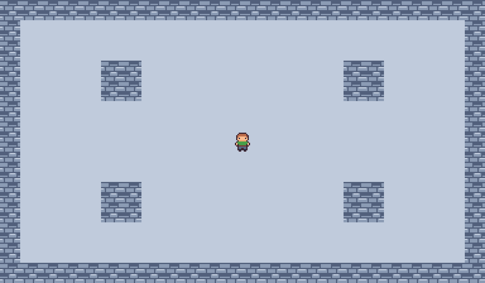

# Fuga do Castelo de Gelo

Projeto do 2º semestre de Jogos Digitais II — Endrik Perin (802.524)

## A carta

- **Tema:** Castelo de gelo com gárgulas
- **Tipo:** Fuga — sobreviver até a saída abrir, e alcançá-la
- **Modo:** Horda (arena vista de cima)

## Como jogar

Setas ou WASD movem o personagem nas quatro direções.

## Créditos

- Tileset: Tiny Town, de Kenney — https://kenney.nl/assets/tiny-town — licença CC0
- Personagem: Prof. Ezefferth, para a Aula 08 de Jogos Digitais II
